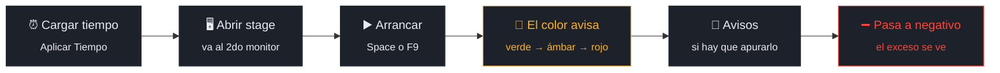
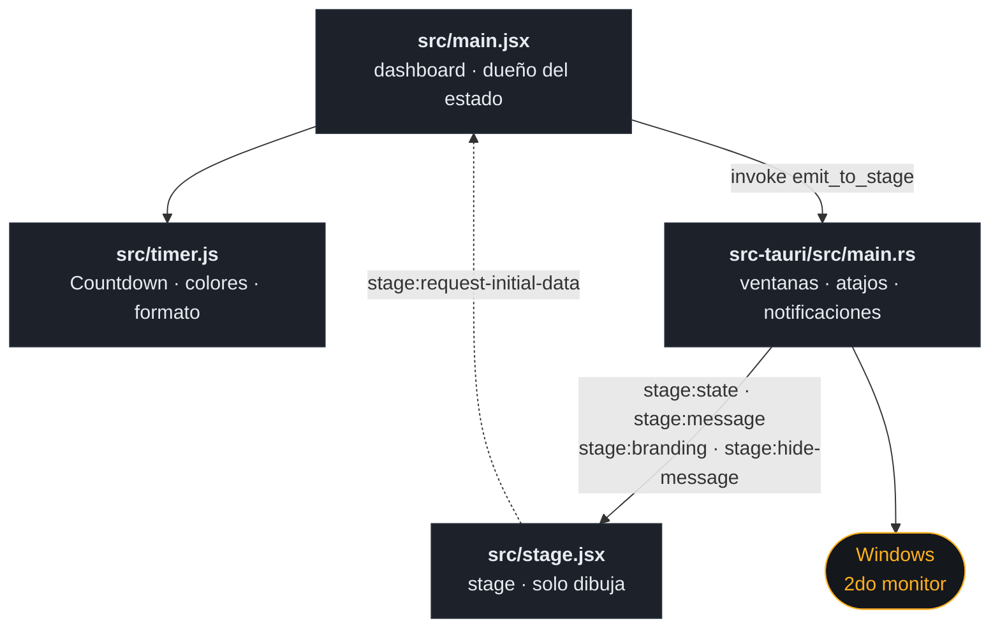

<div align="center">


# Stage Timer Pro

**El reloj que el orador mira y el público nunca ve.**

Dos pantallas: el dashboard en el monitor del operador y el contador a pantalla
completa en el que mira al escenario. Se maneja el tiempo desde una y se le
habla al orador sin interrumpirlo.

<br>


<br>

### [⬇️ &nbsp; Descargar Stage Timer Pro para Windows](https://github.com/matecodedev/stage-timer-pro/releases/latest)

<sub>Gratis · Instalador `.exe` o `.msi` · No hace falta saber programar</sub>

</div>

---

## Qué es

Las conferencias terminan a horario porque alguien mira un reloj que el público
no ve. Stage Timer Pro es ese reloj.

El **dashboard** queda en el monitor del operador: ahí se arma el tiempo, se
arranca, se suman minutos y se mandan avisos. El **stage** ocupa el monitor que
mira al escenario, a pantalla completa, y muestra una sola cosa —el tiempo que
queda— en dígitos que se leen desde el fondo de la sala.

> [!IMPORTANT]
> La versión distribuida es **solo Windows 10 u 11**, con instalador `.exe` y
> `.msi`. El código compila en macOS y Linux, pero los targets del bundle hoy
> son de Windows.

<br>

<div align="center">

| | |
|---|---|
| ⚫ **Fondo negro** | El color del estado pinta el contador, no la pared |
| 🖥️ **Segundo monitor solo** | Detecta la pantalla extendida y se va sola ahí |
| ⌨️ **F9 · F10 · F11** | Atajos globales: andan con la app en segundo plano |
| 💬 **Avisos al orador** | Texto gigante, flotante o reemplazando el contador |
| 📋 **Secuencias** | Varios bloques encadenados con avance automático |
| ➖ **Modo negativo** | Sigue contando pasado el cero, para que el exceso se vea |

</div>

---

## Contenido

**Para usar la app**

- [Instalar](#instalar)
- [Cómo se opera](#cómo-se-opera)
- [Los colores](#los-colores)
- [Avisos al orador](#avisos-al-orador)
- [Secuencias](#secuencias)
- [Límites conocidos](#límites-conocidos)

**Para tocar el código**

- [Compilar desde el código](#compilar-desde-el-código)
- [Cómo funciona por dentro](#cómo-funciona-por-dentro)
- [Decisiones de diseño](#decisiones-de-diseño)
- [Desarrollo](#desarrollo)
- [Empaquetado](#empaquetado)
- [Roadmap](#roadmap)

---

## Instalar

No hace falta saber programar. Es un programa normal de Windows.

1. **[Descargar el instalador](https://github.com/matecodedev/stage-timer-pro/releases/latest)** —
   `Stage.Timer.Pro_<versión>_x64-setup.exe`
2. Doble clic. Elegís el idioma y la carpeta, y te deja los accesos directos.
3. Abrir **Stage Timer Pro**. Listo.

También hay un `.msi` en la misma release, para instalación desatendida o por
política de dominio.

> [!NOTE]
> **Windows va a decir "editor desconocido". Es esperable.**
>
> El instalador todavía no está firmado con certificado, así que SmartScreen
> muestra una pantalla azul de advertencia. Para instalar igual:
> **Más información → Ejecutar de todas formas**.
>
> Si preferís no correr un ejecutable sin firmar —criterio razonable en una
> máquina de control ajena— el código está entero acá arriba y podés
> [compilarlo vos mismo](#compilar-desde-el-código).

### Antes del primer evento

| Necesitás | Detalle |
|---|---|
| Windows | 10 u 11, 64 bits |
| Monitores | Dos, con el del escenario como pantalla **extendida** (no duplicada) |

La pantalla extendida no es un detalle: si Windows está en modo *duplicar*, las
dos salidas muestran lo mismo y el operador termina viendo el contador gigante
en lugar del dashboard.

Al abrir la app, la ventana de stage se posiciona sola en el segundo monitor
después de un segundo. Si no aparece donde corresponde, el botón
**🖥️ Abrir Stage Fullscreen** del dashboard la vuelve a crear, la reposiciona y
le reenvía el estado.

---

## Cómo se opera

El dashboard está dividido en paneles. Los cuatro que se usan durante el show:

| Panel | Para qué |
|---|---|
| ⏰ **Tiempo Inicial** | Horas, minutos y segundos del bloque. **Aplicar Tiempo** lo carga. |
| 🎮 **Controles** | Arrancar, pausar, parar y sumar o restar minutos en vivo. |
| 💬 **Mensajes** | Lo que se le dice al orador sin cortarle la charla. |
| 🎬 **Stage Display** | Abrir, reposicionar y forzar pantalla completa. |

Los otros paneles —secuencias, colores, branding, hora actual— se dejan
configurados **antes** de que empiece.

### Flujo de un bloque



### Teclado

Dos juegos de atajos, y la diferencia importa.

**Globales** — los registra el sistema. Funcionan **aunque la app esté detrás de
otra ventana**, que es la situación real cuando el operador está en el
reproductor de video o en las diapositivas.

| Tecla | Acción |
|---|---|
| `F9` | Arrancar / pausar |
| `F10` | Reiniciar al tiempo cargado |
| `F11` | Pantalla completa del stage |

**Locales** — solo con el dashboard en primer plano.

| Tecla | Acción |
|---|---|
| `Space` | Arrancar / pausar |
| `S` | Parar y volver al inicio |
| `+` · `−` | ± 1 minuto |
| `Ctrl` + `+` · `−` | ± 5 minutos |
| `M` | Mandar el mensaje escrito |
| `H` | Ocultar el mensaje |

> [!TIP]
> Los atajos locales se desactivan solos mientras escribís en un campo. Podés
> tipear "**S**eguí 5 minutos más" en el cuadro de mensaje sin que la `S` te
> frene el timer.

---

## Los colores

El contador cambia de color según el tiempo que queda. Es la información que el
orador lee de reojo, sin tener que interpretar números.

| Estado | Cuándo entra (por defecto) | Color |
|---|---|---|
| **Bueno** | Más del 25% del tiempo restante | Verde oscuro |
| **Transición** | Entre el 25% y los umbrales de abajo | Verde |
| **Precaución** | Últimos 10 minutos | Ámbar |
| **Alerta** | Últimos 5 minutos | Rojo claro |
| **Crítico** | Últimos 2 minutos | Rojo |
| **Terminado** | Cero o negativo | Rojo, titilando, con beep |

Los cuatro umbrales se cambian en **🎨 Colores Avanzados del Timer**, y hay un
preset **Conferencia Estándar** que los lleva a 5 / 15 / 30 minutos y 20%, para
bloques largos.

**El fondo del stage es negro y el color viaja en los dígitos.** No al revés. Un
plano de rojo saturado a pantalla completa, en un televisor grande y a un metro
de la cara del orador, encandila durante cuarenta minutos. El color tiene que
informar, no lastimar. Si preferís el comportamiento viejo —fondo del color del
estado— es un tilde: **Fondo negro** en el panel de branding.

---

## Avisos al orador

Texto grande sobre el stage, para decirle algo sin interrumpirlo.

| Opción | Qué hace |
|---|---|
| **Tamaño** | Hasta 200 px por defecto. Se lee desde el fondo. |
| **Titilar** | Parpadeo, para lo urgente. |
| **Reemplazar timer** | El mensaje ocupa la pantalla entera y el contador desaparece. |
| **Persistente** | Queda hasta que lo saques a mano. Si no, se va solo. |
| **Duración** | Segundos que dura el mensaje no persistente. |

Hay seis predefinidos a un clic: `TIME OUT`, `BREAK`, `5 MINUTOS`,
`ÚLTIMO MINUTO`, `FINALIZANDO`, `PREPARARSE`.

> [!TIP]
> **Reemplazar timer** es más agresivo de lo que parece: el orador se queda sin
> referencia de tiempo mientras dure. Sirve para `TIME OUT`, no para un aviso
> de paso.

---

## Secuencias

Para eventos con varios bloques encadenados: introducción, charla, preguntas,
cierre. Se arman antes y corren solos.

1. Agregar cada bloque con nombre y duración en **➕ Agregar Timer a Secuencia**.
   Hay plantillas de un clic: *Introducción*, *Presentación*, *Q&A*, *Descanso*
   y *Cierre*.
2. **Iniciar secuencia**. Arranca por el primero.
3. Con **avance automático** activo, al llegar a cero pasa solo al siguiente y
   lo arranca.

Mientras corre una secuencia, el stage muestra arriba a la izquierda el nombre
del bloque actual y su posición, y arriba a la derecha unos puntos que marcan
cuántos van y cuántos faltan. Al cambiar de bloque aparece el nombre del que
entra durante tres segundos. Al terminar el último: `SECUENCIA COMPLETADA`.

Se puede saltar a cualquier bloque a mano desde la lista, sin cortar la
secuencia.

---

## Límites conocidos

Estos comportamientos son deliberados, salvo el marcado como **bug**.

| Límite | Motivo |
|---|---|
| **La configuración no sobrevive al cierre.** Colores, logo, umbrales y secuencias se pierden al cerrar la app. | Todavía no hay persistencia en disco. Hay que rearmar el evento en cada apertura. |
| El badge con el tiempo restante solo funciona en macOS. | Se implementa con `osascript`. En Windows y Linux el comando existe pero no hace nada. |
| El logo se carga por **URL**, no desde un archivo local. | El allowlist de Tauri tiene el acceso a disco cerrado a propósito. Un logo local hay que servirlo por HTTP. |
| No hay campo de "nombre del evento". | El branding del stage es logo y paleta de colores. El nombre no está implementado. |
| No hay modo claro. | El dashboard fuerza modo oscuro al iniciar. Una sala de control no se opera en blanco. |
| 🐞 **`F11` no cambia la pantalla completa del stage.** | **Bug.** El handler llama a un comando `get_window` que no existe en el shell de Rust, así que la llamada falla antes de togglear. El botón **🎬 Stage Display** del dashboard sí funciona. |

---

## Compilar desde el código

> A partir de acá el README es técnico. Si solo querés **usar** la app, con
> [instalar](#instalar) y [operar](#cómo-se-opera) ya está.

Hace falta **Node.js 20 o superior**, el **toolchain de Rust** (`rustup`,
`cargo`) y los [prerequisitos de Tauri](https://tauri.app/start/prerequisites/)
de tu plataforma.

```bash
npm install
npm run tauri:dev      # app completa: dashboard + stage
npm run tauri:build    # binario e instalador de la plataforma actual
```

Para iterar solo la interfaz, en el navegador y sin compilar Rust:

```bash
npm run dev            # http://localhost:5173  y  /stage.html
```

> [!WARNING]
> **En el navegador el stage no se abre solo.** Todo el manejo de ventanas pasa
> por comandos de Tauri, que no existen fuera de la app. `npm run dev` sirve
> para tocar estilos y layout; el flujo real de dos ventanas hay que probarlo
> con `npm run tauri:dev`.

En Windows hay un helper de PowerShell con los mismos comandos:

```powershell
.\dev.ps1 dev      # desarrollo
.\dev.ps1 build    # compilar
.\dev.ps1 clean    # limpiar target/
```

---

## Cómo funciona por dentro

Dos ventanas que **no comparten estado**. El dashboard es dueño del tiempo; el
stage solo dibuja lo que le mandan.



| Pieza | Responsabilidad |
|---|---|
| `src/timer.js` | La clase `Countdown`, el estado de color según umbrales y `formatMs`. Sin React ni Tauri: es lógica pura. |
| `src/main.jsx` | Dashboard. Tiene el timer, los paneles y todos los handlers. Empuja el estado al stage en cada cambio. |
| `src/stage.jsx` | Stage. No calcula nada: escucha cuatro eventos y renderiza. |
| `src-tauri/src/main.rs` | Crea y posiciona ventanas, registra los atajos globales y manda notificaciones del sistema. |

### El contrato de eventos

Cuatro eventos, todos con payload JSON serializado como string, siempre en la
dirección dashboard → stage.

| Evento | Lleva |
|---|---|
| `stage:state` | Tiempo restante, color, estado de secuencia y configuración de hora. |
| `stage:message` | Texto, TTL, tamaño, si titila y si reemplaza al contador. |
| `stage:branding` | Colores, logo, tamaño del logo y el tilde de fondo negro. |
| `stage:hide-message` | Nada. Baja el mensaje ya. |

El único evento que va al revés es `stage:request-initial-data`: cuando el stage
se abre pide el estado actual, porque nació sin saber nada.

---

## Decisiones de diseño

Conviene conocerlas antes de tocar el código.

<details>
<summary><b>El fondo del stage es negro y el color pinta los dígitos</b></summary>

<br>

`getBackgroundColor` devuelve negro y `getForegroundColor` devuelve el color del
estado. Antes era al revés: el estado inundaba el fondo entero.

Un plano de color saturado a pantalla completa, en un televisor grande y cerca
de la cara del orador, es agresivo durante una charla larga. La información es
la misma; el castigo visual no.

</details>

<details>
<summary><b>Un color demasiado oscuro sobre negro cae a blanco</b></summary>

<br>

`readableOnBlack` en `src/timer.js` calcula la luminancia relativa (Rec. 709) y,
por debajo de 60 sobre 255, devuelve blanco en vez del color pedido.

Sin ese guard, el gris de "detenido" o un color de marca oscuro dejan el
contador ilegible sobre el fondo negro. **Un contador que no se lee es peor que
uno sin color**, así que la legibilidad le gana a la fidelidad de paleta.

</details>

<details>
<summary><b>El dashboard es el único dueño del tiempo</b></summary>

<br>

El stage no tiene `Countdown` ni intervalo propio: recibe `remainingMs` ya
calculado y lo dibuja.

Dos relojes corriendo en paralelo se desincronizan, y en una pantalla que mira
el orador esa diferencia se nota. Con un solo dueño no hay nada que
reconciliar.

</details>

<details>
<summary><b>El descuento usa `performance.now()`, no el intervalo</b></summary>

<br>

El loop corre cada 100 ms, pero `tick()` no resta 100: mide el delta real contra
la marca anterior.

`setInterval` no garantiza su período —se atrasa si la pestaña se ocupa— y
acumular ticks nominales derivaría varios segundos a lo largo de una charla.

</details>

<details>
<summary><b>El timeout del mensaje se guarda en una ref</b></summary>

<br>

`messageTimeoutRef` retiene el timeout pendiente, y cada envío nuevo cancela el
anterior con `clearTimeout` antes de programar el suyo.

Sin eso, el TTL de un mensaje viejo bajaba el mensaje que estaba al aire —
incluso uno marcado como **persistente**, que por definición no debería irse
solo.

</details>

<details>
<summary><b>Cerrar la ventana de stage la esconde, no la cierra</b></summary>

<br>

El handler de `CloseRequested` llama a `api.prevent_close()` y esconde la
ventana.

Un clic accidental en la ✕ del monitor del escenario, en pleno evento, no puede
destruir la ventana ni tumbar la aplicación. Cerrar el **dashboard**, en
cambio, sí cierra todo: libera los atajos globales y termina el proceso.

</details>

<details>
<summary><b>El allowlist de Tauri está cerrado por defecto</b></summary>

<br>

`allowlist.all` es `false`, y se habilita solo lo que se usa: manejo de
ventanas, notificaciones y atajos globales.

Sistema de archivos, shell, portapapeles, HTTP y diálogos están **todos en
`false`**. La app no necesita tocar el disco, y una máquina de control no es
lugar para dar permisos de más.

Ese cierre tiene una consecuencia visible: el logo se carga por URL, porque leer
un archivo local requeriría abrir `fs`.

</details>

<details>
<summary><b>Los atajos globales son F9, F10 y F11</b></summary>

<br>

Antes eran `Ctrl+Shift+Space`, `Ctrl+Shift+R` y `Ctrl+Shift+F`.

Las combinaciones con modificadores chocan seguido con lo que ya tiene tomado
Windows o el software de presentación que corre al lado. Las teclas de función
altas casi no las reclama nadie, y el operador las encuentra sin mirar el
teclado.

</details>

---

## Desarrollo

```
src/
  main.jsx     dashboard: estado del timer, paneles y handlers
  stage.jsx    stage: escucha eventos y renderiza
  timer.js     Countdown, umbrales de color y formato — lógica pura
  index.css    Tailwind y las animaciones (blink, shimmer, heartbeat)
src-tauri/
  src/main.rs        comandos, ventanas y atajos globales
  tauri.conf.json    allowlist, targets del bundle y ventana principal
docs/          manual de usuario, guía de compilación, FAQ y notas técnicas
```

Tres dependencias de runtime: **`react`**, **`react-dom`** y
**`@tauri-apps/api`**.

> [!NOTE]
> **No hay suite de tests en esta rama.** Los problemas serios de este proyecto
> aparecieron operando la app con dos monitores reales, no en una suite: la
> ventana que nace en el monitor equivocado, el mensaje persistente que se caía
> solo, el color ilegible sobre negro. Antes de un evento conviene ensayar el
> bloque completo con el proyector enchufado.

---

## Empaquetado

```bash
npm run tauri:build
```

Deja los instaladores en `src-tauri/target/release/bundle/`. Los targets
configurados son `msi` y `nsis`, así que el resultado es
`Stage.Timer.Pro_<versión>_x64-setup.exe` y
`Stage.Timer.Pro_<versión>_x64_en-US.msi`.

El NSIS es un instalador asistido con selector de idioma (inglés y español) e
instalación **por usuario**, sin pedir permisos de administrador.

Las releases se publican solas: al pushear un tag `v*`, el workflow
[`release.yml`](.github/workflows/release.yml) compila y sube los binarios a una
release de GitHub.

> [!WARNING]
> El instalador **no está firmado**. Windows va a mostrar el aviso de SmartScreen
> con *"editor desconocido"* al ejecutarlo. Los datos de MateCode aparecen igual
> en Panel de control → Programas, pero sin firma nadie los puede verificar.

---

## Roadmap

- [x] Fondo negro con el color del estado en el contador.
- [x] Licencia MIT y publicación abierta para la comunidad de eventos.
- [x] Instalador de Windows con selector de idioma.
- [ ] Arreglar `F11`: falta el comando o hay que usar la API de ventana del front.
- [ ] Persistir la configuración del evento entre sesiones.
- [ ] Firmar el instalador con un certificado a nombre de MateCode.
- [ ] Reponer el target de macOS en el bundle, o quitar `macos-latest` del
      workflow de release, que hoy compila algo que no se publica.

---

<div align="center">

**Stage Timer Pro** · Hecho por [MateCode](https://matecode.dev)

<sub>Licencia [MIT](LICENSE) — usalo, modificalo y compartilo libremente.<br>
Software libre para la comunidad técnica de eventos.</sub>

</div>
